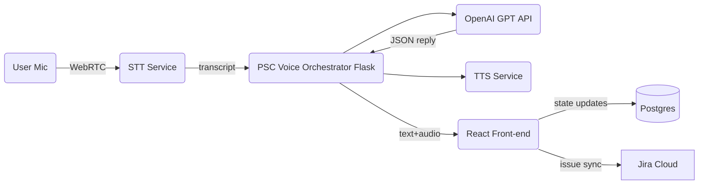

# Product Strategy Council – Audio‑First Extension  
*(Context file for Cursor; June 2025)*  

---

## 1 Problem Statement  
The **Product Strategy Council (PSC)** web‑app helps product teams debate, score, and prioritise ideas.  
Today interaction is **keyboard‑ and mouse‑centric**, which slows real‑time collaboration and excludes on‑the‑go or accessibility‑focused users. We need an **always‑on, low‑friction audio interface** that:

1. Lets any participant **speak** inputs/prompts at any point in the existing PSC workflow.  
2. **Seamlessly toggles** between voice and manual text entry—no hard mode switch.  
3. Responds in **text *and* optionally speech**, preserving current UI state.  

---

## 2 MVP Goal (2‑Week Sprint)  
Ship a **“Voice Room”** layer inside PSC enabling **Cold‑Start Feature Discovery** sessions.  
**Success metric**: A user completes a 3‑persona simulation via voice in < 5 min while latency ≤ 2 s.

---

## 3 High‑Level Solution Overview  



* **STT**: OpenAI Whisper (server‑side) – fallback: Web Speech API.  
* **TTS**: ElevenLabs Stream API (mp3 chunks).  
* **Orchestrator**: Python / Flask (Autogen or custom) – manages persona turns + scoring.  
* **Front‑end**: React (Next.js via Cursor) with Tailwind; MicButton component always visible.  

---

## 4 Detailed Requirements  

### 4.1 Functional  
| ID | Requirement | Notes |
|----|-------------|-------|
| F‑1 | Global **MicButton** (+ ⌘ M hotkey) visible on every PSC page. | Shows listening state. |
| F‑2 | **Partial ASR** feedback—live caption while user speaks. | Improves trust. |
| F‑3 | **Voice → Transcript → GPT** pipeline auto‑sends when user pauses ≥ 600 ms. | Configurable. |
| F‑4 | PSC responses return **text** (always) and **audio** (if “Speak replies” toggle = on). | Default off. |
| F‑5 | Typing in any input field **automatically mutes mic** until field blur. | Prevents overlap. |
| F‑6 | **Latency budget** ≤ 2 s round‑trip for ≤ 20 word utterance. | Measure & log. |

### 4.2 Non‑Functional  
| Category | Target |
|----------|--------|
| Security | All audio & text routed over TLS; transcripts stored ≤ 7 days encrypted. |
| Cost     | Speech+LLM COGS < ₹10 per 10‑min session. |
| Accessibility | Keyboard‑only fallback still fully functional; captions for TTS. |

---

## 5 Two‑Week Implementation Plan  

| Day | Deliverable | Owner | Notes |
|-----|-------------|-------|-------|
| 0 | Repo & Notion board initialised | PM | — |
| 1 | **MicButton** React component scaffold | FE | Tailwind, Icon. |
| 2 | Whisper STT endpoint & basic Flask route | BE | Dockerfile ready. |
| 3 | Autogen persona orchestrator CLI | BE | Unit‑tested. |
| 4 | TTS streamer util (ElevenLabs) | BE | Caches replies. |
| 5 | Integrate STT→LLM→TTS loop | FE/BE | Local demo. |
| 6 | Persona library (Buyer, User, Security) YAML | PM | v1. |
| 7 | Front‑end chat bubbles + audio playback | FE | Styled. |
| 8 | Score calculator (RICE) sidebar | BE | RICE JSON → UI. |
| 9 | Jira export webhook | BE | Dev Jira. |
|10 | Instrument Postgres metrics & Grafana | DevOps | Tokens, latency. |
|11 | Mobile responsive tweaks | FE | — |
|12 | Security hardening & rate limits | DevOps | OWASP top 5 pass. |
|13 | Pilot pack (PDF + Loom) | PM | — |
|14 | Roll‑out to 5 design‑partners | PM | Support Slack. |

---

## 6 API & Data Contracts  

### 6.1 `/api/stt` → Whisper  
```http
POST /api/stt
Body: audio/wav | mp3             # max 10 MB
Returns: { "transcript": "text", "confidence": 0.92 }
```

### 6.2 `/api/simulate` → GPT orchestrator  
```http
POST /api/simulate
Body: {
  "prompt": "string",
  "personas": ["buyer", "user", "security"]
}
Returns: {
  "transcript": [...],            # array of persona utterances
  "scores": { "reach":8,"impact":6,"confidence":7,"effort":3,"total":1200 },
  "tts_urls": ["https://…/0.mp3",…]
}
```

### 6.3 `/api/export/jira`  
Pushes backlog items ordered by `total` score into Jira Product Discovery.

---

## 7 Development Guidelines  

1. **TypeScript** on front‑end, **Python 3.11** on back‑end.  
2. **Single eslint + prettier config** shared via monorepo root.  
3. **Env vars** managed with `.env.local` (never commit secrets).  
4. **Test**: Jest (FE), Pytest (BE) – minimum 70 % coverage on core logic.  
5. **Codegen**: Use OpenAI GPT function‑calling to scaffold boilerplate but always review.  

---

## 8 Risks & Mitigations  

| Risk | Likelihood | Mitigation |
|------|------------|------------|
| High STT/TTS latency | Med | Batch mode fallback; cache TTS per sentence. |
| Browser mic permission issues | Med | Graceful error overlay, docs. |
| Cost spike | Low | Daily COGS chart; autostop sessions > 15 min. |
| Privacy concerns | Med | Short retention, on‑prem option roadmap. |

---

## 9 Future Extensions (Post‑MVP Roadmap)  

1. **Wake‑word detection** (“Hey PSC”) using Vosk.  
2. **Multimodal persona** with live screen context.  
3. **Custom fine‑tuned scoring model** trained on session outcomes.  
4. **Edge STT** via device WebAssembly for offline use.  

---

*Prepared by ChatGPT o3 – June 3 2025*  
